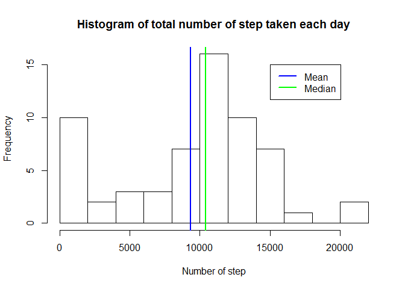
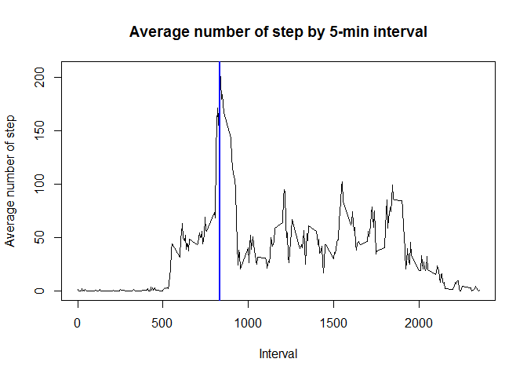
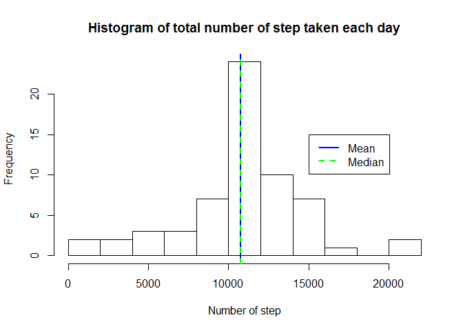
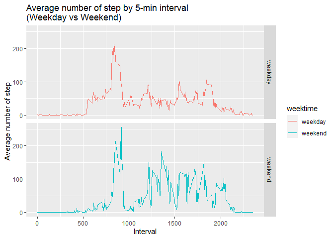

## Loading and preprocessing the data
The libraries used during this assignment are loaded, and the data are loaded from csv.  
The date are formatted

```r
library(ggplot2)
library(plyr)
DataLoad <- read.csv("./activity.csv")
DataLoad$date <- as.Date(as.character(DataLoad$date))
```


## What is mean total number of steps taken per day?

```r
TotStepDay <- data.frame(date=unique(DataLoad$date),
                            steps=with(DataLoad,tapply(steps,date,sum,na.rm=TRUE)))
hist(TotStepDay$steps,breaks = 10,xlab="Number of step",
     main="Histogram of total number of step taken each day")
abline(v=mean(TotStepDay$steps),lwd=2,col="blue")
abline(v=median(TotStepDay$steps),lwd=2,col="green")
legend(x=15000,y=15,legend=c("Mean","Median"),col=c("blue","green"),lwd=2)
```

<!-- -->

The mean and median values are calculated

```r
mean(TotStepDay$steps)
```

```
## [1] 9354.23
```

```r
median(TotStepDay$steps)
```

```
## [1] 10395
```

## What is the average daily activity pattern?

```r
MeanStepInt <- data.frame(interval=unique(DataLoad$interval),
                         mean=with(DataLoad,tapply(steps,interval,mean,na.rm=TRUE)))
plot(MeanStepInt$interval,MeanStepInt$mean,type="l",
     xlab="Interval",ylab="Average number of step",
     main="Average number of step by 5-min interval")
abline(v=MeanStepInt$interval[which.max(MeanStepInt$mean)],lwd=2,col="blue")
```

<!-- -->

The maximum number of step is reached for the following 5-min interval

```r
MeanStepInt$interval[which.max(MeanStepInt$mean)]
```

```
## [1] 835
```

## Imputing missing values
The number of NA values is calculated

```r
sum(is.na(DataLoad))
```

```
## [1] 2304
```
The choice is made to fill the missing values with the average step for the corresponding 5-min interval

```r
DataLoadFill <- cbind(DataLoad,rep(MeanStepInt$mean,61))
colnames(DataLoadFill) <- c("steps","date","interval","mean")
DataLoadFill$steps[is.na(DataLoadFill$steps)] <- DataLoadFill$mean[is.na(DataLoadFill$steps)]
```


```r
TotStepDayF <- data.frame(date=unique(DataLoadFill$date),
                         steps=with(DataLoadFill,tapply(steps,date,sum,na.rm=TRUE)))

hist(TotStepDayF$steps,breaks = 10,xlab="Number of step",
     main="Histogram of total number of step taken each day")
abline(v=mean(TotStepDayF$steps),lwd=2,col="blue")
abline(v=median(TotStepDayF$steps),lwd=2,col="green",lty=2)
legend(x=15000,y=15,legend=c("Mean","Median"),col=c("blue","green"),lwd=2,lty=c(1,2))
```

<!-- -->

There are important differences when the NA are filled because the mean and median are centered together.
The mean and median values are calculated (there are the same)

```r
mean(TotStepDayF$steps)
```

```
## [1] 10766.19
```

```r
median(TotStepDayF$steps)
```

```
## [1] 10766.19
```

## Are there differences in activity patterns between weekdays and weekends?

```r
DataLoadFillWE <- DataLoadFill
DataLoadFillWE$weektime <- as.factor(ifelse(weekdays(DataLoadFillWE$date) %in% 
                   c("samedi","simanche"),"weekend", "weekday"))

MeanStepIntWE <- ddply(DataLoadFillWE, c("interval","weektime"), summarise, mean=mean(steps))

ggplot(MeanStepIntWE, aes(interval, mean)) + geom_line(aes(colour=weektime)) + facet_grid(weektime ~ .) + 
  ggtitle("Average number of step by 5-min interval\n(Weekday vs Weekend)") + xlab("Interval") + 
  ylab("Average number of step")
```

<!-- -->
